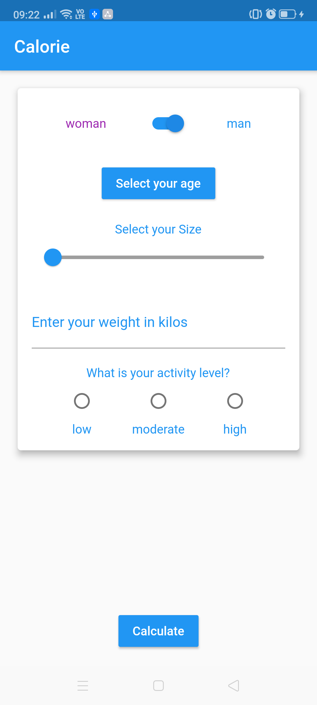
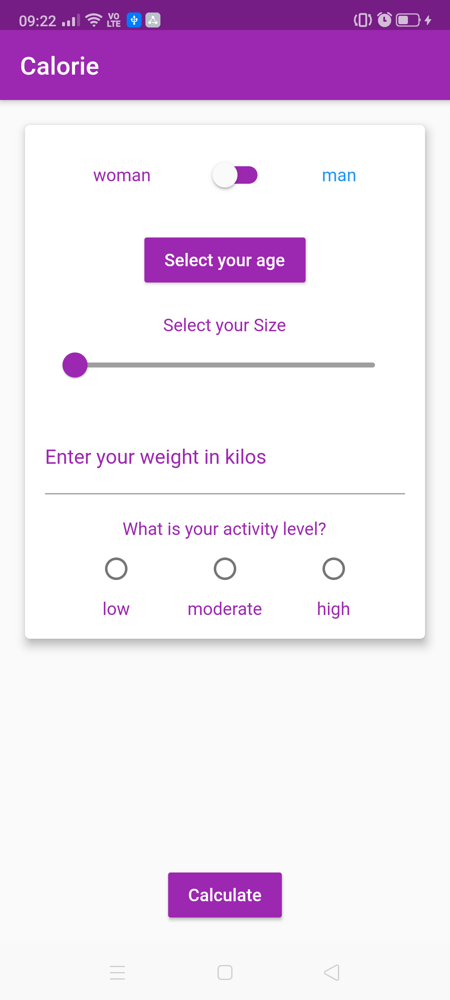

# calorie_app

**Goal**: A Flutter application to calculate the calories per day.

## Phone display

      

## Requirements
* Computer (Windows, Mac or Linux)
* Android Studio

## Setup the project in Android studio
1. Download the project code, preferably using `git clone https://github.com/YannMancel/calorie_app.git`.
2. In Android Studio, select *File* | *Open...*
3. Select the project

## Troubleshooting

### No device available during the compilation and execution steps 
* If none of device is present (*Available Virtual Devices* or *Connected Devices*),
    * Either select `Create a new virtual device`
    * or connect and select your phone or tablet
     
     
## Useful
* [Download Android Studio](https://developer.android.com/studio)
* [Create a new virtual device](https://developer.android.com/studio/run/managing-avds.html)
* [Enable developer options and debugging](https://developer.android.com/studio/debug/dev-options.html#enable)